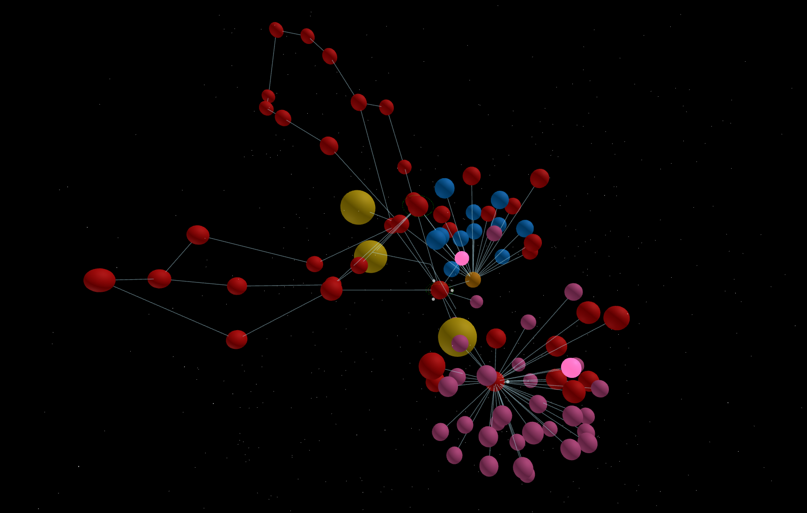

# **Visual Internet Prototype V2 (VIP)**

This is the **new version of VIP**, now built on a **Neo4j graph database**. The original version was built using SQL and can be found here:  
[**Original Visual Internet Prototype**](https://github.com/Norsninja/Visual_Internet_Prototype).

### **Changes 2/22/25:**
- **Decoupled Scanning & Persistence:**
The scanning functions (e.g., ARP, traceroute) have been separated from database updates. An orchestrator module now gathers and preprocesses network data, packaging it into structured payloads for persistence in Neo4j. This modular approach simplifies maintenance and testing.

- **Improved Concurrency Management:**
A global lock has been introduced to prevent overlapping scans—particularly for long-running traceroute operations—ensuring each full scan completes without race conditions.

- **Focused Local Scanning:**
The scheduled full scan now exclusively handles local network data (router info, ARP scans, and traceroute hops) while preserving on-demand scans for BGP, web, remote traceroute, and port scans. This means external scans are triggered only via user requests, exactly as before.

- **Dynamic External Target Synchronization:**
The system now retrieves the external target configuration from the Neo4j database (with a fallback to a default value) before running traceroutes. This guarantees that traceroute operations always use the most up-to-date target.

- **Consistent Labeling & Relationship Management:**
Node labeling and relationship creation are now centralized via dedicated functions, ensuring that all nodes (routers, devices, external nodes, etc.) and relationships (e.g., CONNECTED_TO, TRACEROUTE_HOP) are created and maintained consistently throughout the system.


---

## **About This Project**
**Visual Internet Prototype (VIP)** is my attempt to **visually map the internet** using common network tools and present it as a **3D world that can be explored**. 

This version is primarily developed in **Python**, serving as a proof of concept before transitioning into **Unity** for a more interactive experience. While I am not proficient in either, this project is an ongoing **learning process**, and with a combination of **experimentation, willpower, and GPT**, I plan to improve each iteration.

My ultimate goal is to create an **exploration program** that **procedurally builds the network**, incorporating **emergent elements** to simulate the feeling of exploring something entirely new. Initial tests have **proven viability**, reinforcing my belief that this tool can be used not only to explore the internet but also to **secure local networks** through practical **network security tools**.



---

## **Features**
### **🔍 Dynamic & Persistent Network Mapping**
- The map **updates dynamically**—if something on the network changes, the map changes as well.
- Nodes represent **devices**, and **moons** around them symbolize **open ports** that can be further explored.

### **🌐 Web Scanning & Hyperlink Discovery**
- If an **open web port** is found, it can be **scanned further** to extract **hyperlinks**.
- If the link **targets a new IP**, it is **added dynamically** to the network for further exploration.

### **📡 BGP Scanning & Large-Scale Internet Mapping**
- Run a **BGP (Border Gateway Protocol) scan** to reveal **Autonomous Systems (ASNs)**.
- **ASNs appear as larger nodes**, providing a **macro view of the internet**.

### **📊 Full Data Persistence & Analysis**
- All **scan data** is **stored persistently** in a **Neo4j graph database**.
- Past scan information can be **retrieved and reviewed** at any time (almost working).

### **🚀 Real-Time 3D Visualization**
- **Fly through the network** in a **3D interactive environment**.
- **Explore** new nodes, **trace routes**, and **identify security risks**.

---

## **Current Development Focus**
I am currently working on:
1. **Ensuring accurate data ingestion into the Neo4j graph database.**
2. **Structuring data efficiently** to support real-time analysis and visualization.
3. **Expanding the environment with emergent behaviors** that give rise to **"life-like" network phenomena**.

This is only the **beginning of the journey**—every iteration brings **more accuracy, depth, and interactivity**.

---

## **Installation & Usage**
### **Prerequisites**
- **Python 3.8+**
- **Neo4j database running locally or remotely**
- **Network scanning dependencies (Scapy, Requests, BeautifulSoup, etc.)**
- **Three.js frontend for visualization** *(optional for headless scanning)*

### **Installation**
```bash
# Clone the repository
git clone https://github.com/Norsninja/Visual_Internet_Prototype_V2.git
cd Visual_Internet_Prototype_V2

# Install dependencies
pip install -r requirements.txt


