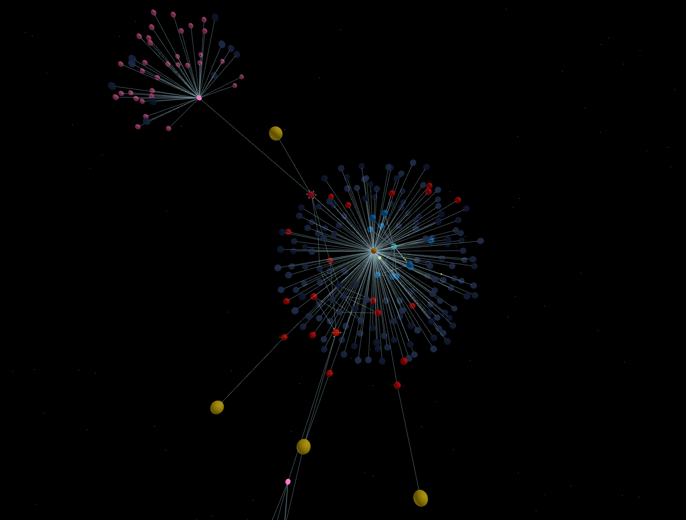

# **Visual Internet Prototype V2 (VIP)**

This is the **next-generation version of VIP**, built on a **Neo4j graph database** to enable sophisticated network mapping, visualization, and exploration. The original version was built using SQL and can be found here:  
[**Original Visual Internet Prototype**](https://github.com/Norsninja/Visual_Internet_Prototype).



## **Latest Updates (March 5, 2025)**

### 🚀 **Interactive Ship and Navigation System**
* **First-Person Exploration Mode**: Press `V` to toggle between external view and cockpit view for immersive network exploration
* **Flight Controls**: Use WASD keys to navigate through the network in cockpit mode with realistic physics
* **Dynamic Camera System**: Seamless transitions between orbit camera and first-person perspectives

### 🧬 **Cellular Automata Visualization System**
* **Procedural Node Visualization**: Nodes now display dynamic cellular automata patterns based on their network characteristics
* **Genetic Algorithm Integration**: Nodes develop unique visual "genes" that influence their appearance and behavior
* **Visual Evolution**: Network connections can trigger "genetic" exchanges between nodes, creating emergent visual patterns

### 🔎 **Mysterious Node Appearance**
* **Unexplored External Nodes**: External nodes now appear with a mysterious appearance until they are discovered
* **Discovery Mechanics**: Clicking on an unexplored node reveals its true nature with a visual transition effect
* **Visual Distinction**: Clear differentiation between explored and unexplored areas of the network

### 🔄 **Enhanced Edge Management System**
* **Multi-Layer Edge Rendering**: Different types of connections (standard vs web) are now visually distinguished
* **Dynamic Edge Updates**: Edge positions update efficiently based on node movement
* **Traffic Visualization**: Network traffic is represented through animated particles along edges

### 💻 **React-Based UI Framework**
* **Modern Component Architecture**: UI rebuilt using React for better performance and maintainability
* **Draggable Information Panels**: Node information can be viewed in draggable panels that don't interfere with navigation
* **Context-Aware Node Info**: Different node types (standard, web, ASN) display specialized information interfaces

### 📊 **Traffic Monitoring**
* **Local Network Traffic Meter**: Real-time visualization of local network traffic with rate-of-change indicators
* **Animated Traffic Particles**: Visual representation of data flowing between nodes
* **Performance-Optimized Rendering**: Efficient updates that maintain high frame rates

### 🌐 **Enhanced Network Scanning Features**
* **Comprehensive Node Details**: Full integration of various scan types (port, web, SSL, BGP)
* **Advanced Analysis Tools**: Expanded capabilities for security assessment and network mapping
* **Remote Traceroute Capabilities**: Extended support for remote network exploration

## **About This Project**

**Visual Internet Prototype (VIP)** is an attempt to **visually map the internet** using common network tools and present it as a **3D world that can be explored**. 

This version is primarily developed using **Python** for the backend, **Neo4j** for data storage, and **Three.js** with **React** for the frontend visualization. While developed by a non-expert, this project demonstrates how a combination of **experimentation, determination, and AI assistance** can produce sophisticated technical solutions.

The ultimate goal is to create an **exploration program** that **procedurally builds the network**, incorporating **emergent elements** to simulate the feeling of exploring something entirely new. Initial tests have **proven viability**, reinforcing the belief that this tool can be used not only to explore the internet but also to **secure local networks** through practical **network security tools**.

## **Core Features**

### **🔍 Dynamic & Persistent Network Mapping**
- The map **updates dynamically**—if something on the network changes, the map changes as well
- Nodes represent **devices**, and **moons** around them symbolize **open ports** that can be further explored
- **Full persistency** with Neo4j graph database storage for historical analysis

### **🌐 Web Scanning & Hyperlink Discovery**
- If an **open web port** is found, it can be **scanned further** to extract **hyperlinks**
- If the link **targets a new IP**, it is **added dynamically** to the network for further exploration
- **DNS resolution** and content analysis provide deeper insights into web resources

### **📡 BGP Scanning & Large-Scale Internet Mapping**
- Run a **BGP (Border Gateway Protocol) scan** to reveal **Autonomous Systems (ASNs)**
- **ASNs appear as larger nodes**, providing a **macro view of the internet**
- **Relationship mapping** between ASNs shows major internet backbone connections

### **🧠 Intelligent Node Management**
- **Efficient State Management**: New GraphState system for centralized node data handling
- **Optimized Physics Engine**: Improved node positioning and movement simulation
- **Smart Caching System**: RequestQueue implementation to prevent API request thundering herds

### **🔒 Network Security Analysis**
- **Port scanning** reveals potential entry points to network devices
- **Service detection** identifies running applications and potential vulnerabilities
- **Banner grabbing** and **service fingerprinting** for deeper security analysis

## **Technical Improvements**

### **Architecture Enhancements**
- **Modular Component Design**: Better separation of concerns between system components
- **Three.js Integration**: Advanced rendering techniques for better visualization
- **Optimized Rendering**: Significant performance improvements for large networks

### **Code Quality and Organization**
- **Enhanced Error Handling**: More robust error recovery throughout the system
- **Improved Async Operations**: Better handling of concurrent operations and network requests
- **Consistent Coding Patterns**: Standardized approaches to common tasks

### **Performance Optimizations**
- **Frame-Skipping Logic**: Heavy operations are staggered across frames for smoother performance
- **Batch Processing**: Resource-intensive tasks are grouped and processed in manageable chunks
- **Throttled Updates**: Animations and state changes are paced to maintain responsive UI

## **Previous Updates**

### **Changes for 2/24/25:**
- Added a local network traffic meter showing traffic on the local network and rate of change over time
- Removed testing files for the traffic_meter
- Added a retrieve relationship endpoint to routes.py
- Modified the camera and ship for flight navigation
- Implemented procedural node generation using Cellular Automata
- Added visual transformation when all required scans for a node are completed

### **Changes 2/22/25:**
- **Decoupled Scanning & Persistence**: Separated scanning functions from database updates with an orchestrator module
- **Improved Concurrency Management**: Added global lock to prevent overlapping scans
- **Focused Local Scanning**: Scheduled full scans now exclusively handle local network data
- **Dynamic External Target Synchronization**: System retrieves external target configuration from Neo4j
- **Consistent Labeling & Relationship Management**: Centralized node labeling and relationship creation

## **Known Issues and Areas for Improvement**
- Web nodes and web edges still have connectivity issues after web scans
- External network nodes could benefit from better organizational structure
- Some performance issues may occur with very large networks
- Further refinement needed for the genetic algorithm parameters

## **Future Development Plans**
- Enhance the genetic algorithm to create more meaningful visual patterns
- Implement more sophisticated physics for node organization
- Expand scanning capabilities to support additional protocols
- Further improve the UI/UX for more intuitive navigation
- Develop more advanced security analysis features

## **Installation & Usage**

### **Prerequisites**
- **Python 3.8+**
- **Neo4j database** running locally or remotely
- **Network scanning dependencies** (Scapy, Requests, BeautifulSoup, etc.)
- **Modern web browser** with WebGL support

### **Installation**
```bash
# Clone the repository
git clone https://github.com/Norsninja/Visual_Internet_Prototype_V2.git
cd Visual_Internet_Prototype_V2

# Install dependencies
pip install -r requirements.txt

# Configure Neo4j connection details in config.py
# Start the Flask server
python app.py
```

### **Usage**
1. Open your browser and navigate to `http://localhost:5000`
2. The initial local network scan will begin automatically
3. Use mouse controls to navigate in external view mode:
   - Click + drag to rotate the camera
   - Scroll to zoom in/out
4. Press `V` to enter cockpit mode and use WASD keys to fly through the network
5. Click on nodes to view information and perform additional scans
6. Press `M` to toggle the network navigation overlay

## **Contributing**
Contributions, suggestions, and feedback are welcome! Feel free to open issues or submit pull requests.

## **License**
This project is open source and available under the [MIT License](LICENSE).